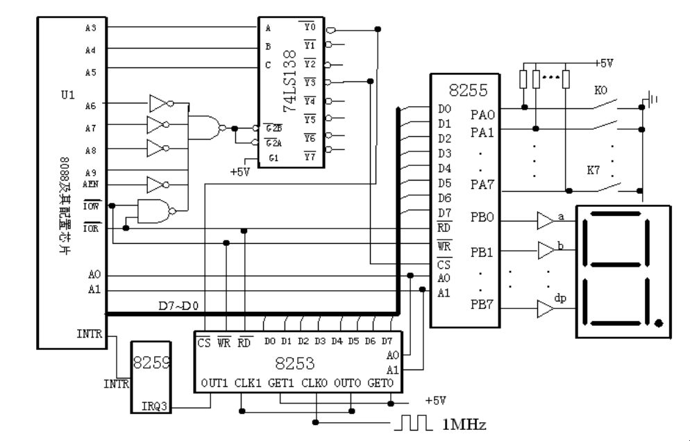
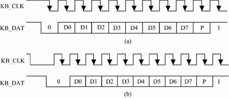
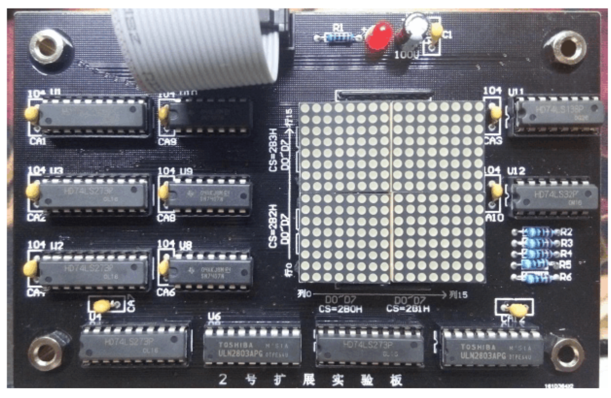

# Microcomputer-Design-
微机原理课设
## basic_program.asm
### 题目描述
通过A端口读入按键值，用数码管轮流显示按键值的高四位和低四位，具体方式为：高四位显示 1 秒，低四位显示 0.5 秒。 如此反复循环显示，如果有键盘按键输入，则退出程序并返回操作系统。 

### 设计思路
1. 程序开始时，先进行硬件的的初始化设置，以及中断的相关设置。
2. 8253每0.5s触发一次中断，设置一个在1-3之间变化的变量用作计数器，用以区分高位显示1s与低位显示0.5s。
3. 进入中断程序后，读8255PA按键值，确定该显示高位或低位，查表得到数码管段码，在PB输出。
4. 不执行中断程序时，循环检测是否有键按下，若按下则恢复中断设置，返回DOS。

### 硬件接线图

  

### 流程图

  

## extend_program_1.asm

### 题目描述
通过实验台上 PS2 接口连接键盘，要求：   
1)输入字符（0\~F），转换成十进制后用数码管（1、2）显示（00\~15）；   
2)用实验台上的数码管（3、4）显示输入的次数，计数范围 0～99。  

### 硬件接线表
1. 8255
    1. PA7----PS2:DATA
    2. PB----数码管段码
    3. PC0-PC3----数码管位码
    4. CS----138:0290H-0293H
2. PS2
    1. CLK----非门----8259:IRQ3
    2. DATA----8255:PA7
### PS2接口时序图

  

a为键盘到主机串行通信

### 流程图

  

## extend_program_4.asm
### 题目描述
利用 8253、8255 和中断系统实现以下功能：  
 1）使液晶屏实现秒表功能，显示数字 00.00～10.00，每隔 0.01 秒数字变化一次；   
 2）读入8个开关的状态值，将这两位数字以16进制（范围 00H～FFH）在 16x16LED点阵模块上显示。  

### 硬件接线表
1. 8353
    1. CLK0----1MHz
    2. OUT0----CLK1
    3. CS----138:0280H-0283H
2. 8255
    1. PA----LCD:D0-D7
    2. PB----8个开关
    3. PC0----LCD:RS
    4. PC1----LCD:R/W
    5. PC2----LCD:E
    6. CS----0290H-0293H
3. 8259
    1. IRQ3----启动/暂停单脉冲
    2. IRQ4----清零单脉冲
4. 16*16LED点阵:JX1扩展板
    1. 列高8位----02B1H
    2. 列低8位----02B0H
    3. 行高8位----02B3H
    4. 行低8位----02B2H

### 流程图

  

## 参考资料
[PS2](https://blog.csdn.net/xqhrs232/article/details/78350203?utm_medium=distribute.pc_relevant.none-task-blog-baidujs_baidulandingword-8&spm=1001.2101.3001.4242)
[ST7920说明书](https://wenku.baidu.com/view/19f93f58be23482fb4da4c21.html)

  

[16*8字模](https://wenku.baidu.com/view/e9b30eeb524de518964b7d77.html)